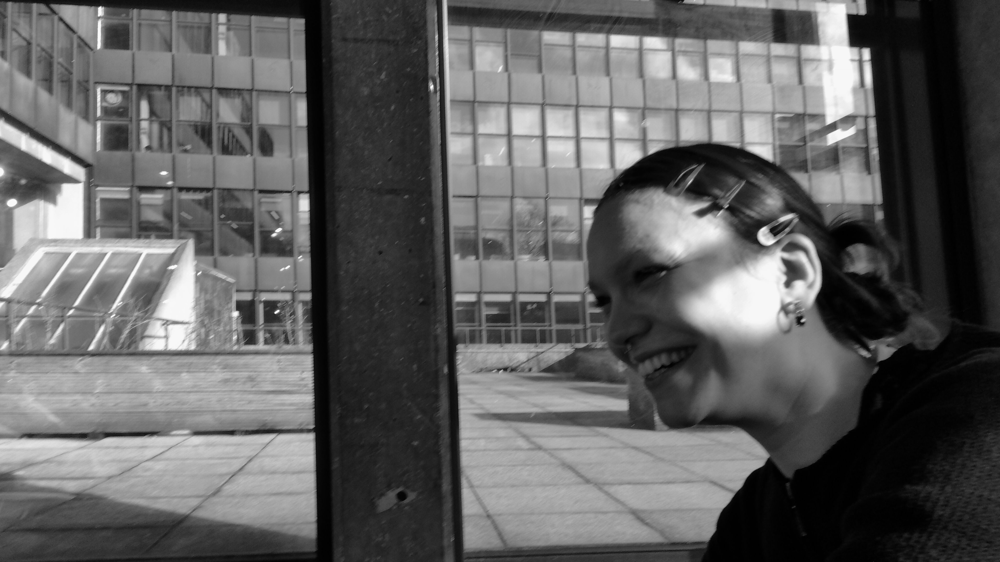

# About {.unnumbered}

Hi, welcome to my Learning Diary for Remotely Sensing City and Environments module!
This module is part of the Bartlett Centre for Advanced Spatial Analysis (CASA), University College London (UCL) MSc degree in Urban Spatial Science. 

My name is Hania and I am aspiring urban spatial scientist, with my background is in physics and arts. I'm passionate about spatial justice and environmental issues, and I'm super excited to explore how remote sensing can help address those problems!

::: {#fig-week1-setup fig-cap="Me:)"}

:::