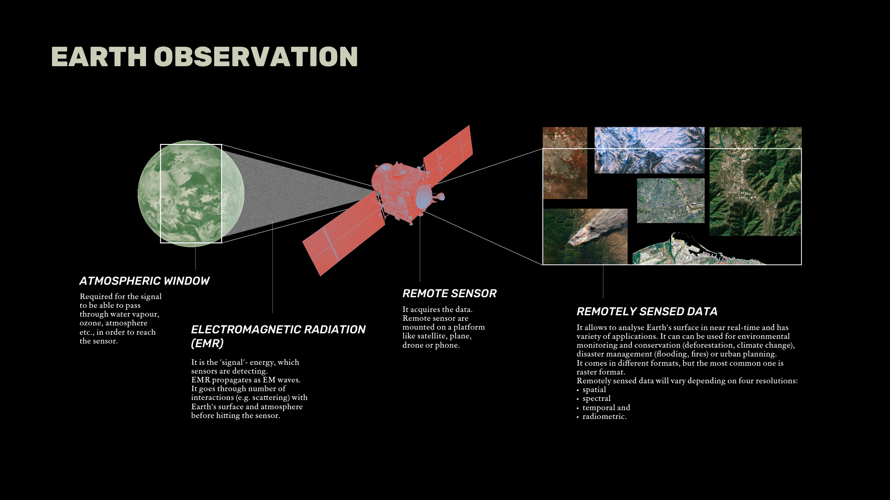
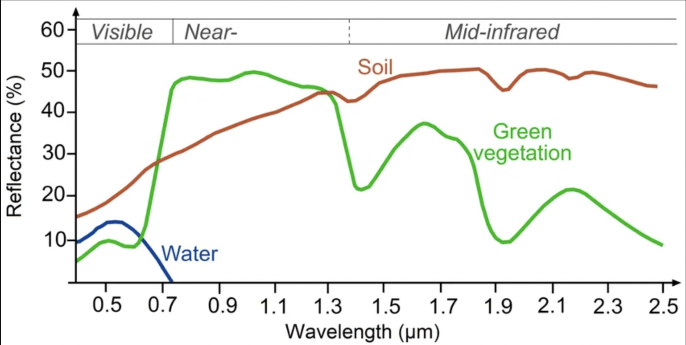

This week we explored the fundamentals of Earth Observation (EO), which is the science of collecting and analysing date about our planet from a distance.

::: {#fig-week1-setup fig-cap="Earth observation basics."}

:::

The core of this process is **Electromagnetic Radiation (EMR)**. As @fig-week1-setup show, EO satellites don't just take a photo; they capture how EMR interacts with Earth's surface through absorption, transmission, or scattering. I found the distinction between sensor types useful for understanding data constraints:

| Feature | Passive Sensors (e.g., Landsat) | Active Sensors (e.g., LiDAR, SAR) |
|:---|:---|:---|
| **Energy Source** | External (Sun) | Internal (Sends its own pulse) |
| **Constraint** | Limited by daylight and cloud cover | Can "see" through clouds and at night |
| **Use Case** | Spectral analysis and color | Structural and topographic mapping |

: Comparison of Passive and Active Remote Sensing Sensors {#tbl-sensors}

For me, highlight form this lecture was to learn that everything on Earth has a unique **spectral signature**-a digital fingerprint based on how it reflects light across different wavelengths. While the concept is straightforward, the complexity arises when trying to distinguish between similar surfaces, especially when atmospheric interference modify the signal.

::: {#fig-week1-setup fig-cap="Example of spectral signatures. [Source](https://www.researchgate.net/figure/Typical-spectral-signatures-of-specic-land-cover-types-in-the-VIS-and-IR-region-of-the_fig2_326405082) of the image."}

:::

## Spectral Signature in Research 

To better grasp spectral signatures we will look at environmental monitoring example. @pivovar2023spectral demonstrate how hyperspectral imaging can detect stress in Norway spruce trees before the damage is even visible to the human eye. By analyzing subtle shifts in the trees spectral signatures under thermal stress, researchers can identify physiological changes early. This is exactly what I find so fascinating about it! It shows that EO can be more than “just” a mapping tool and can act as a diagnostic tool for forest health.

Similarly, these signatures allow us to create indices like NDVI (Normalized Difference Vegetation Index), which quantifies greenness by exploiting the contrast between visible red and near-infrared reflectance. This brings us to @martinez22, who discusses the link between RS and polices, by applying NDVI to urban policy. Their work demystifies how these calculations can inform greening interventions in cities.

Nevertheless, both of these approaches come with limitations. NDVI, although simple and widely used, is often seasonally dependent and can be inaccurate in areas with sparse vegetation or high soil background (more on that in [Correction for Remote Sensing](week3.qmd) chapter!). On the other hand, the hyperspectral approach used by @pivovar2023spectral requires a lot of computational power and specialised sensors that aren't as readily available as standard multispectral satellites. This makes it difficult to scale their high-detail diagnostic method to a global or even regional level compared to the more accessible NDVI.

## Reflections

Having background in Physics, I spent fair amount of time exploring electromagnetic waves through equations and theories. Sometimes it felt like we are exploring them for sake of exploration, so learning more about real world applications, and through the mean of gathering more information about the Earth was supper interesting and refreshing. 
It was my first time learning about remote sensors, and about EO in general, so I’m really excited to learn more about its applications. Can’t wait to get more hands on experience and see how to apply correction to satellite imagery as well as how to extract more information from it. The adventure just begins!:)
