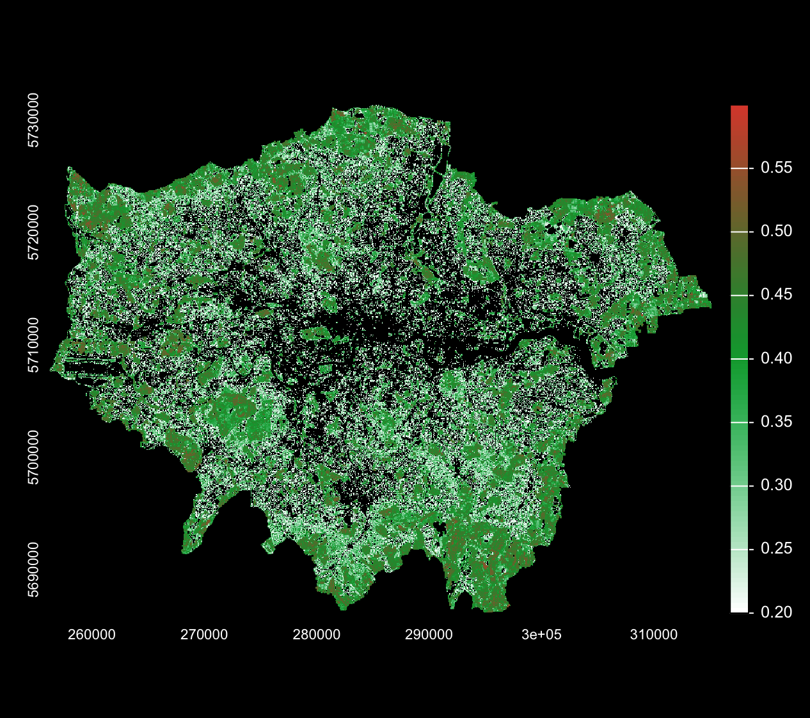
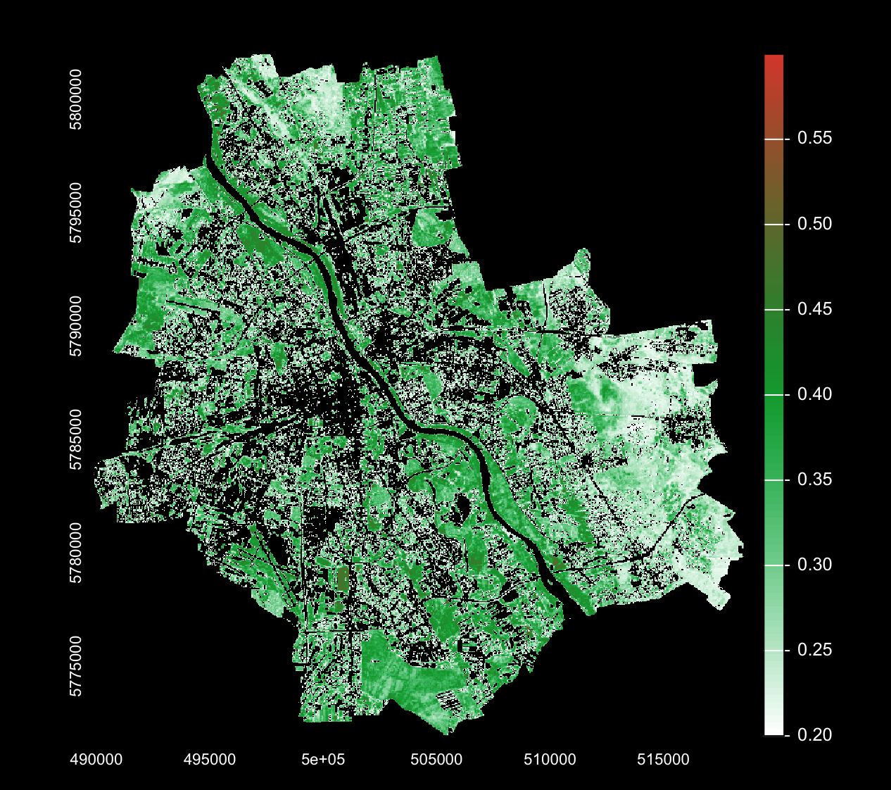

When dealing with satellite data, in most cases, we will deal with pre-processed imagery, which is ready to analyse. There is number of remote sensing data corrections and in this section I would like to introduce few of them, with a main focus on specific ratio index - Normalised Difference Vegetation Index (NDVI).

## Filtering, Texture Analysis and Principal Component Analysis (PCA)

Before focusing on NDVI, I explored several image processing techniques introduced in the practical, including **filtering, texture analysis and Principal Component Analysis (PCA)**. Visually, it might seems like they didn’t improve the image, but it reduces small-scale pixel noise and stabilises local variation. Such reduction is relevant when performing further statistical operations (e.g. texture or PCA), as these methods can otherwise be too sensitive to pixel-to-pixel differences that may come from sensor noise rather than real landscape structure. I then calculated GLCM texture (homogeneity) using a 7×7 window. Instead of looking at color (reflectance), texture looks at how pixels are arranged. High homogeneity means the surface is smooth and consistent, like a large forest or a lake. Low values mean the area is varied and complex, like a busy city.

Finally, PCA was applied to the stacked spectral and texture layers to reduce redundancy between correlated bands. PCA transforms the data into new components (PC1, PC2, etc.) that capture decreasing proportions of overall variance. While PCA can be useful for dimensionality reduction and classification, the resulting components are abstract combinations of original variables and therefore less directly interpretable than NDVI (again visually not really helpful!). To sum up, these steps demonstrated how preprocessing choices influence visual outputs as well as statistical stability. 

## The Normalised Different Vegetation Index (NDVI) 

::: {#fig-comparison layout-ncol="2"}
{group="cities"}

{group="cities"}

Side-by-side spatial analysis of vegetation index. Click either image to expand and compare scales.
:::

My initial spin on practical content came from genuine interest in comparison of green coverage between London and Warsaw. I started off with purely looking at the visualisation of NDVI for both cities wondering if there are significant differences visible to the naked eye. For both cities I used imagery from May 2024, to minimise differences which might be caused by seasonal variations. The minimum of NDVI value was chosen based on fact that for urban areas NDVI \> 0.2 is considered to be threshold for “some” vegetation. Maximum NDVI was set to be 0.6, as for London NDVI \> 0.6 is less than 0.001% of the city area, and for Warsaw max NDVI value is 0.58.

Although some differences are visible, visualisations weren’t very informative. I decided to run very basic descriptive statistics (see Table 3.1), which revealed a bit more about cities greenery. Warsaw had a slightly higher percentage of vegetation cover, while London seems to have higher value for max NDVI (as well as slightly higher mean NDVI) indicating spots of more lush greenery in the city. The vegetation cover of 66% and 64% seemed like very high values, and after cross-checking with literature it turned to be way off. According to [Mayor of London website](https://www.london.gov.uk/programmes-strategies/environment-and-climate-change/parks-green-spaces-and-biodiversity/green-infrastructure-maps-and-tools?ac-49556=49548) London green cover is around 51.7%, while Husqvarna Urban Green Space Insights (HUGSI) website shows that [London](https://hugsi.green/cities/London) green space is 41%, and [Warsaw](https://hugsi.green/cities/Warsaw) 50%.

This variations might be partially due to differences in definitions of green space (maybe different thresholds or not accounting for private gardens or green roofs) , but mostly due to simplicity of the method I used. Landsat 8 data has resolution of 30 m, while Sentinel 2 (used in HUGSI analysis) has a resolution of 10-20 m. When using Landsat 8 data we are analysing 900 m² pixels, which can lead to eg. having very small, but very healthy green backyard which can push an average NDVI pixel value to be \> 0.2, and therefore count the whole pixel as a vegetation. Pixels which contains a mix of concrete, asphalt, and small garden patches are called “mixed pixel” and can cause a lot of issues in remote sensing. As noted by @martinez22, NDVI thresholds can be misleading exactly due to the mixed pixels. 

| City   | Max NDVI | Mean NDVI (Veg) | Veg Cover % |
|:-------|:---------|:----------------|:------------|
| Warsaw | 0.585    | 0.302           | 66.47%      |
| London | 0.721    | 0.346           | 64.11%      |

: NDVI Comparison: Warsaw vs. London {#tbl-ndvi width="100%"}

## Reflections

This week I definitely feel I learned a lot, and being able to answer small “research question” I had in my head through looking at NDVI indices was very satisfying. Because of the simplicity of the method I felt like I really understood everything what was happening in the code, and I could make small adjustments in the methods fully knowing what’s going on. I’m also glad I “experienced” the imperfections of this method on my own skin, as it gave me this deeper understanding what could be done differently and why NDVI might not work in many cases. In a future I would love to learn more about methods which would be complementary to this, and e.g. would help resolve the issue of mixed pixels. 
