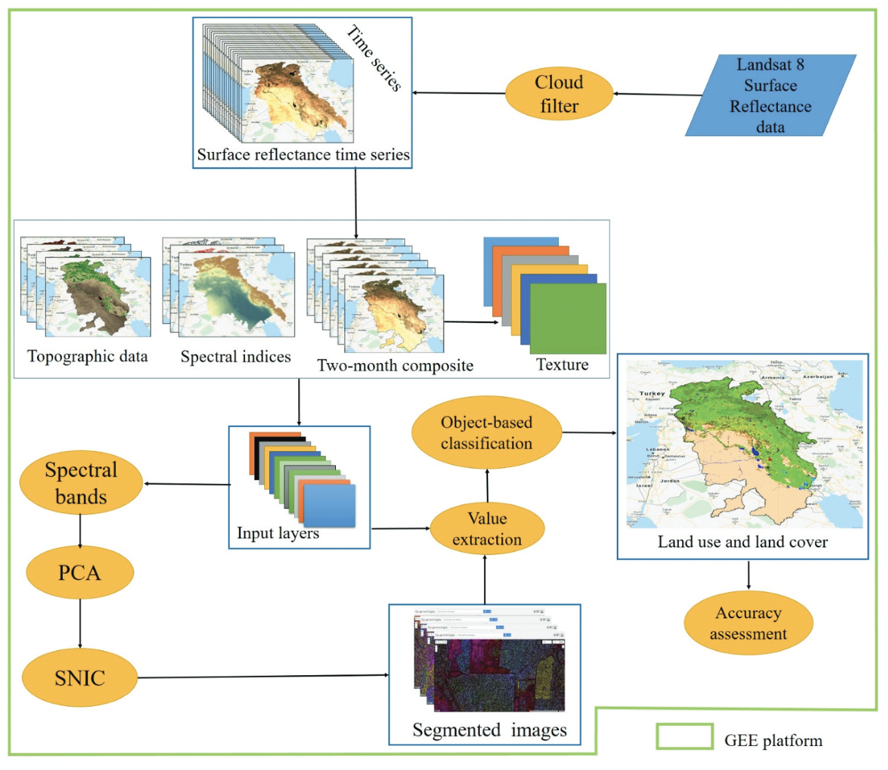

*Note: This entry is combination of Classification I and Classification II lectures, as those lectures are closely related and it felt more natural that way!*

Now that we’ve seen how GEE functions in the real world, it’s time to dive deeper into the specific analysis methods used to interpret satellite imagery. This entry focuses on classification - the process of using machine learning algorithms to categorize pixels into discrete land cover or land use classes (e.g., water, forest, or urban) based on their spectral characteristics.

In the following sections, I’ll compare Pixel-Based Classification with Object-Based Image Analysis (OBIA), critically reflecting on when to use each and the limitations they bring to a project. 

## Machine Learning in Action: The Pixel Based approach

As a simple example of pixel-based classification, using Random Forest (RF), I’ll use workflow demonstrated in the practical. Here is little snippet of practical showing the **supervised classification** using random forest of 100 decision trees:

```javascript
// Train a Random Forest classifier with 100 trees
var rf_classifier = ee.Classifier.smileRandomForest(100).train({
  features: training,
  classProperty: 'class',
  inputProperties: bands
});

// Apply the classification to the clipped image
var classified_map = waytwo_clip.classify(rf_classifier);
```

This produced a Land Use/Land Cover (LULC) map of Wroclaw:

::: {#fig-week7 fig-cap="LULC map of Wroclaw, made in GEE."}

:::

While the result looks ok, I’m quite skeptical of the training process. Because I manually selected the training polygons, the model is entirely dependent on my subjective visual assessment of what looks like "forest" versus "general vegetation" or "urban." This manual approach doesn't guarantee high accuracy. Furthermore, the output is notably “grainy” - a fundamental limitation of pixel-based methods. 

## Shifting the Approach: Testing OBIA

To "smooth out" the LULC map and improve spatial logic, I decided to shift the workflow toward OBIA. Unlike pixel-based methods, OBIA groups pixels into meaningful "objects" (like an individual building or a lake) through a process called segmentation before classifying them.

My first attempt at OBIA was quite poor- it appeared "blocky" and unnatural, with results that felt less representative than my initial pixel-based map. I decided to tune in some of the SNIC segmentation parameters going from: 

```javascript
var snic = ee.Algorithms.Image.Segmentation.SNIC({
  image: waytwo_clip, 
  size: 20,
  compactness: 1,
  connectivity: 8,
  neighborhoodSize: 128
}).select(['B2_mean', 'B3_mean', 'B4_mean', 'B5_mean', 'B6_mean', 'B7_mean'], 
          ['B2', 'B3', 'B4', 'B5', 'B6', 'B7']); 
```

to:

```javascript
var snic = ee.Algorithms.Image.Segmentation.SNIC({
  image: waytwo_clip, 
  size: 10,           // REDUCED: smaller seeds = finer detail for urban areas
  compactness: 0,     // SET TO 0: allows segments to be irregular/organic shapes 
  connectivity: 8,   
  neighborhoodSize: 256 // INCREASED: gives the algorithm more "room" to find boundaries
}).select(['B2_mean', 'B3_mean', 'B4_mean', 'B5_mean', 'B6_mean', 'B7_mean'], 
          ['B2', 'B3', 'B4', 'B5', 'B6', 'B7']);
``` 

Although spatial coherence improved after those adjustments, the overall thematic accuracy still looked worse than my first map (see @fig-week7fig2).

::: {#fig-week7fig2 fig-cap="Visualising making of LULC map of Wroclaw, using OBIA method."}

:::

## Refining the “Object”- Why My OBIA Failed

Through this process, I realised that for OBIA to be truly effective, the Random Forest algorithm needs more "descriptors" than a pixel-based model. In my trial, I only provided spectral means (the average colour of the object). To improve this, I would need to perform more detailed feature extraction between the segmentation and classification stages (not limited only to mean spectral values). 
By extracting textural and geometric descriptors, I could provide the Random Forest with the context it needs to distinguish between spectrally similar classes, for instance, telling the difference between a smooth grass lawn and a rough forest canopy based on texture rather than just greenness.

As noted by @shafizadeh2021google, sophisticated models often incorporate GLCM (Gray-Level Co-occurrence Matrix) texture measures and geometric attributes, such as "linearity" for identifying roads. This transforms the input from a simple "mean colour" into a multi-dimensional description of what a feature looks like and how it is shaped-an essential step for mapping complex urban environments like Wroclaw. Here is great depiction of such complex OBIA workflow:

::: {#fig-week7fig2 fig-cap="*Flowchart of the general process of LULC classification within the GEE environment.- @shafizadeh2021google*"}

:::

### ...so what is the best approach?

While well-performed OBIA offers very detailed, and context-sensitive maps, it does come with at the cost- it’s more computationally expensive and requires more expertise than simple pixel-based RF classification. Due to those limitations it would be difficult to work with it when we want to map global changes like [Global Forest Change](https://glad.earthengine.app/view/global-forest-change#bl=off;old=off;dl=1;lon=-0.7526137189502302;lat=4.652604809147838;zoom=3;). @hansen2013high mapped global forest change, using 30m pixel resolution classification. It’s great for monitoring the big picture, but as mentioned [here](https://www.science.org/doi/full/10.1126/science.1248753) it comes with serious shortcomings. For instance, some deforested areas converted into plantations might be still be classified as a forests. 

In cases where classification based on a whole 30m pixel fails, **sub-pixel analysis** offers a solution. @chen2021monitoring demonstrated this by using Landsat time series to monitor forest degradation. Unlike Hansen's binary approach (forest vs. non-forest), sub-pixel analysis uses Spectral Mixture Analysis to estimate the fraction of vegetation within a pixel. This allows detection subtle changes (like selective logging) where the canopy is thinned but the pixel hasn't technically turned into a field yet.

All those technical subtleties loops back to treating science as an art, and knowing that at the end it is subjective, and might come with (un)intentional biases. What works for global mapping might often fail for the local scale, and interpreting results obtained from classification, should involve checking them against other types of evidence.  


## Reflections 

These two weeks were super interesting, though conceptually quite a stretch! Since I’m also taking CASA0006, it was great to see a bridge forming between ML theory and remote sensing practice. It served as a solid revision of what we’ve covered in Data Science module, but from a different angle. Seeing the tangible results you can achieve with spatial data makes the complexity of ML feel much more exciting. 

I still struggle to navigate different classification workflows, and I know that learning to adjust parameters with confidence will take time and practice. Nevertheless, I really enjoyed getting into the weeds of classification and I’m looking forward to gaining more fluency in combined ML and RS projects. In the future, I would love to be able to write algorithms for detecting urban growth or identifying informal settlements.
