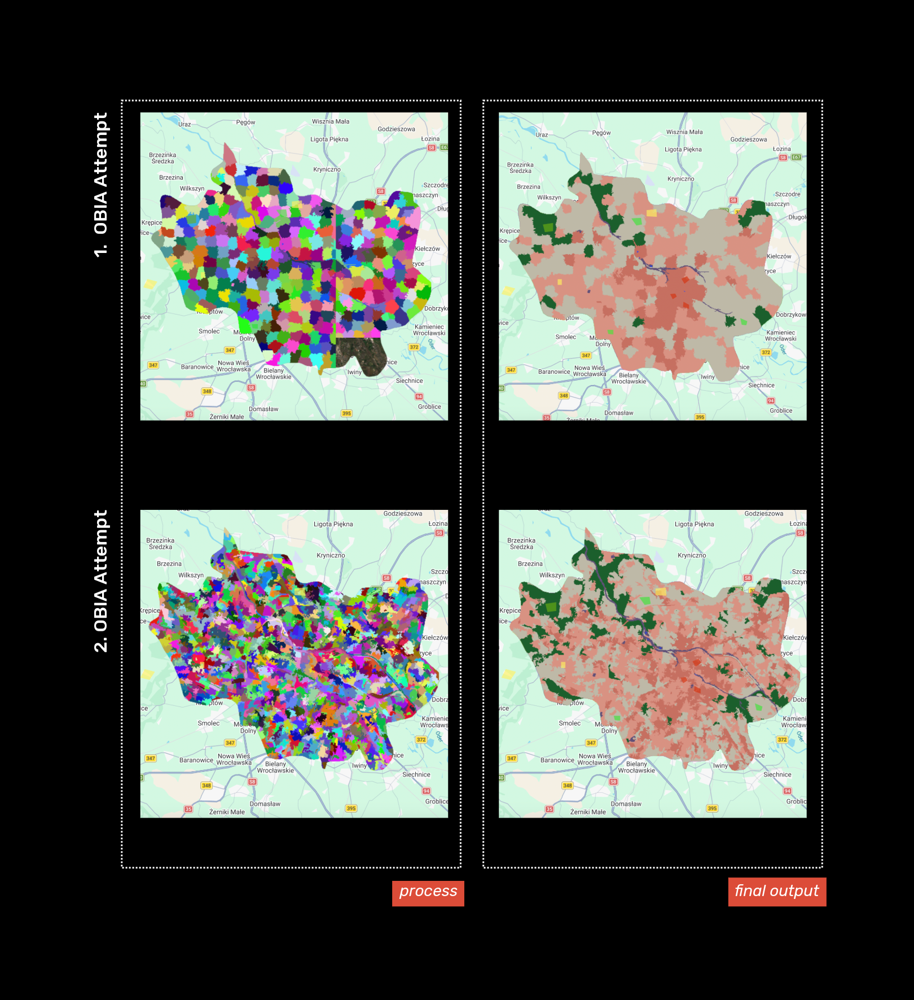

*Note: This entry is combination of Classification I and Classification II lectures, as those lectures are closely related and it felt more natural that way!*

Now, after having an overview of how GEE is used in real world, we will dive deeper into some specific analysis methods that can be applied to satellite imagery. This entry will mostly revolve around classification methods- process of using machine learning algorithms to categorise pixels in satellite imagery into discrete land cover or land use classes (e.g. water, forest, urban) based on their spectral characteristics. To grasp the big picture of classification methods/workflows used in remote sensing I created this graph. 
As quick example of pixel-based classification, using Classification and Regression Trees (CART) and Random Forest (RF), I’ll use workflow demonstrated in the practical. Here is little snippet of practical showing the **supervised classification** using random forest of 100 decision trees:

```javascript
// Train a Random Forest classifier with 100 trees
var rf_classifier = ee.Classifier.smileRandomForest(100).train({
  features: training,
  classProperty: 'class',
  inputProperties: bands
});

// Apply the classification to the clipped image
var classified_map = waytwo_clip.classify(rf_classifier);
```

Which resulted in LULC map of Wroclaw:

::: {#fig-week7 fig-cap="LULC map of Wroclaw, made in GEE."}

:::

It looks ok, but I’m quite sceptical about the training process used in this method. I manually chose training polygons, which mean I purely based it on visual assessment what looks like forest vs “general” vegetation vs urban areas etc. It was great practice run for classification methods, but I decided to modify this workflow to shift it to Object-Based Image Analysis (OBIA)


::: {#fig2-week7 fig-cap="Visualising making of LULC map of Wroclaw, using OBIA method."}

:::


## Applications 

## Reflections 

This week was super interesting, though conceptually quite a stretch! Since I’m also taking CASA0006, it was great to see a bridge forming between ML theory and remote sensing practice. It served as a solid revision of what we’ve covered in Data Science module, but from a different angle. Seeing the tangible results you can achieve with spatial data makes the complexity of ML feel much more exciting.
